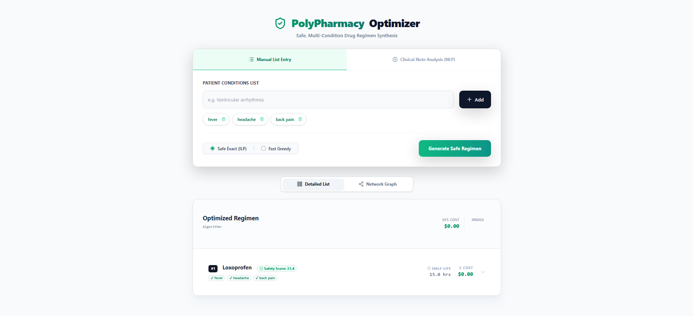
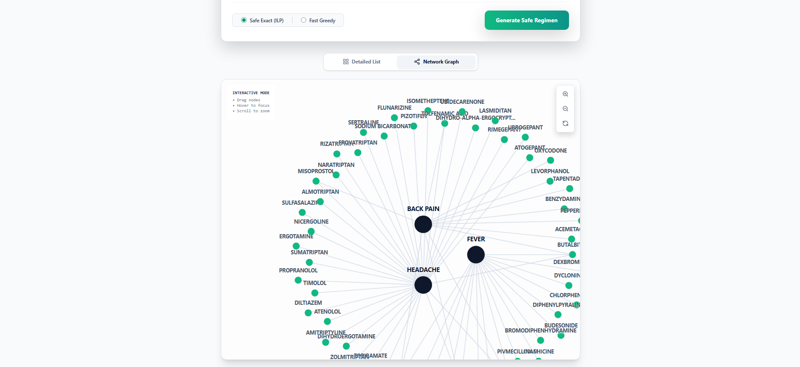
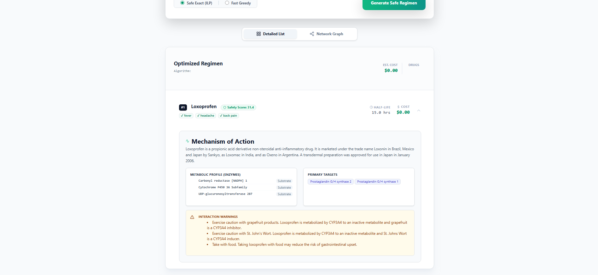

# Clinical Drug Regimen Optimizer

A Python-based Clinical Decision Support System (CDSS) that uses **Integer Linear Programming (ILP)** and **Natural Language Processing (NLP)** to recommend minimal, safe, and cost-effective drug regimens for patients with multiple co-occurring conditions.

## Project Overview

This system tackles the problem of **polypharmacy** (taking too many medications) by finding the mathematical optimal set of drugs that:

1. Covers all patient conditions.
2. Minimizes the total number of drugs (prioritizing dual-purpose agents).
3. Avoids **Direct Drug-Drug Interactions**.
4. Avoids **Metabolic Conflicts** (CYP450 Inhibitor/Inducer clashes).
5. Respects **Route of Administration** (e.g., Eye drops for Glaucoma vs. Pills for Hypertension).






## Key Features

* **Hybrid Optimization Engine:**
* **ILP Solver (`pulp`):** Guarantees the mathematically optimal solution.
* **Greedy Heuristic:** High-speed approximation for complex queries.


* **Advanced Safety Checks:**
* **Context-Aware Mapping:** Automatically excludes contraindicated drugs (e.g., banning Beta-Blockers if "Asthma" is present).
* **Mechanism-Based Conflict Detection:** Identifies risks not listed in standard databases by analyzing enzyme kinetics (e.g., CYP3A4 inhibition).


* **NLP Interface:**
* Uses a distilled BioBERT model (`d4data/biomedical-ner-all`) to extract clinical conditions from free text.
* Includes custom token reconstruction to handle fragmented medical terms.


* **Streaming ETL Pipeline:**
* Efficiently processes massive XML datasets (>1GB) using streaming parsers to build a normalized SQLite database.


## System Architecture

1. **Data Ingestion:** Parses raw DrugBank XML into 17 structured CSVs.
2. **Storage:** Loads data into a relational SQLite database (`drug_project.db`).
3. **Core Logic:**
* `optimizer.py`: Contains the ILP formulation and interaction graph logic.
* `etl.py`: Handles data cleaning and loading.


4. **API Layer:** FastAPI server exposing endpoints for React/Frontend consumption.

## Prerequisites

* Python 3.8+
* **DrugBank Database:** You must obtain the `full database.xml` from [DrugBank](https://go.drugbank.com/releases/latest) (requires a verified account).

### Dependencies

Create a `requirements.txt` with:

```text
fastapi
uvicorn
pulp
transformers
torch
numpy

```

## Installation & Setup

1. **Clone the Repository**
```bash
git clone https://github.com/yourusername/drug-optimizer.git
cd drug-optimizer

```


2. **Install Dependencies**
```bash
pip install -r requirements.txt

```


3. **Prepare Data**
* Place your downloaded `database.xml` file in the `data/` directory.
* Rename it to `database.xml` (or update `XML_FILE` in `drugbank_parser.py`).


4. **Run the ETL Pipeline**
This process extracts data, builds CSVs, and initializes the SQLite database.
```bash
# Step 1: Parse XML to CSV (Takes ~5-10 mins depending on file size)
python data/drugbank_parser.py

# Step 2: Load CSVs into SQLite
python etl.py

```


5. **Start the Server**
```bash
python server.py

```


* Server will start at `http://0.0.0.0:8000`
* API Docs available at `http://localhost:8000/docs`


## API Endpoints

### 1. Optimize (Structured Input)

**POST** `/optimize`

```json
{
  "conditions": ["Hypertension", "Migraine", "GERD"],
  "mode": "ilp"
}

```

* **mode**: `"ilp"` (Recommended) or `"greedy"`.

### 2. Optimize (Free Text / NLP)

**POST** `/optimize/text`

```json
{
  "text": "Patient suffers from severe headaches and regular stomachache.",
  "mode": "ilp"
}

```

* *Note:* The first request will trigger the download of the BERT model (~250MB).

### 3. Graph Visualization Data

**POST** `/graph`
Returns nodes and links for visualizing the Condition-Drug coverage network.

## Algorithm Details

The ILP model minimizes the following objective function:

Where:

* : Heavily penalizes adding more drugs.
* : Penalizes interactions (Direct: 500, Metabolic: 300).
* : Penalizes intrinsic toxicity and long half-life.

## Project Structure

```text
├── frontend/
│   ├── public/
│   ├── src/
│   │   └── components/
├── data/
│   ├── drugbank_parser.py    # XML Streaming Parser
│   ├── database.xml          # (Ignored in git) Source Data
│   └── *.csv                 # Intermediate data files
├── database.py               # SQLite Schema Definition
├── etl.py                    # Extract-Transform-Load Logic
├── optimizer.py              # Mathematical Optimization Core
├── server.py                 # FastAPI Backend & NLP
└── drug_project.db           # Generated Database

```

## Disclaimer

**This software is for research and educational purposes only.** It is **not** a substitute for professional medical advice, diagnosis, or treatment. The interaction data is derived from DrugBank but may not be exhaustive. Always consult a qualified healthcare provider before making medical decisions.
